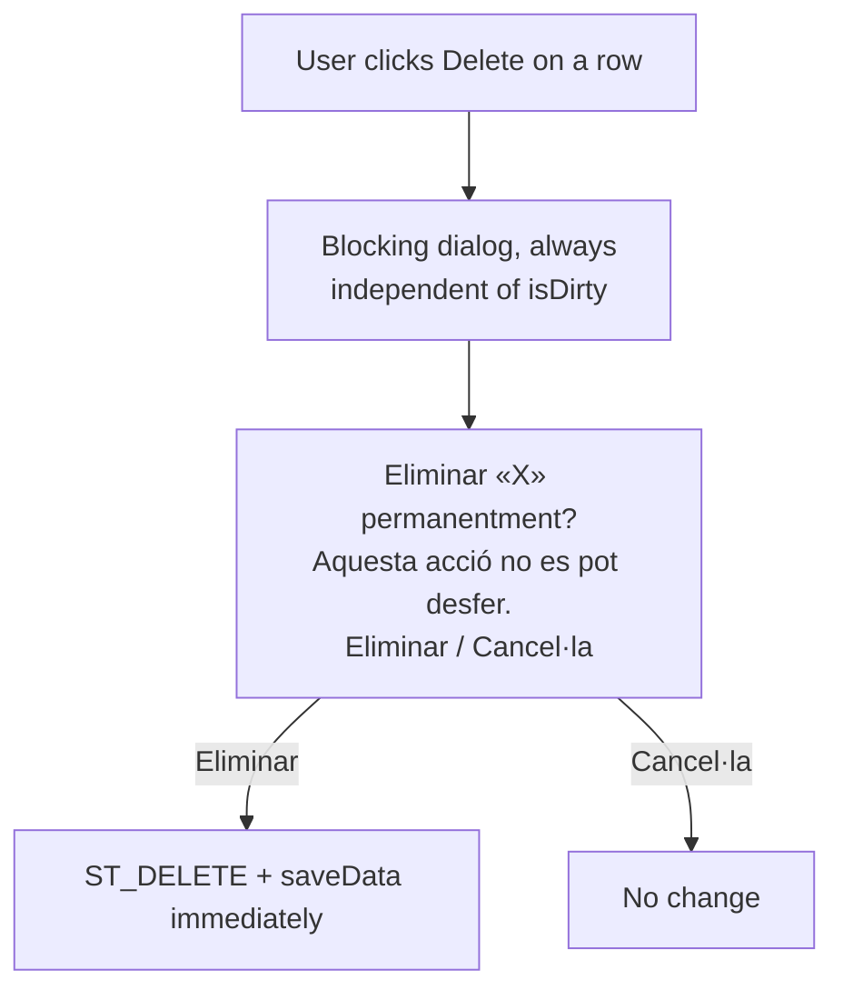

# Redesign products screen

Captured: 2026-09-22

Design reference (wireframe, not binding on implementation details):
https://claude.ai/artifact/NuN3tbBSbW94aNRFNXYJm7

## Goal

Simplify the products management screen (`ProductsPanel`) by removing
redundant navigation/toolbar chrome, moving sorting into the product-filter
area, making "New" a clear primary action, and replacing the current
implicit/no-confirmation delete with an explicit confirmation step.

Separately (see "Autosave bug" below), fix the underlying data-layer
behaviour that silently persists pending changes — including deletes — on
any list navigation, with no confirmation of any kind.

## Context

Current screen structure:

- `src-pos/com/openbravo/pos/inventory/ProductsPanel.java` — screen
  controller (`JPanelTable2` subclass).
- `src-pos/com/openbravo/pos/inventory/ProductsEditor.java` — right-hand
  record editor (tabs: General / Purchase-Stock / Catalog / Properties).
  `initComponents()` L931, `buildHeader()` L1019, `buildActions()` L1092
  (builds the Save button at the bottom of the editor).
- `src-pos/com/openbravo/pos/ticket/ProductFilter.java` — filter bar
  (barcode field + reference/name/category/brand form). `initComponents()`
  L172.
- `src-pos/com/openbravo/pos/panels/JPanelTable.java` — shared screen shell
  (abstract base of `JPanelTable2`): NORTH = filter (`getFilter()`), CENTER =
  `JSplitPane` with record list + editor, toolbar built in
  `startNavigation()` L73-135.
- `src-data/com/openbravo/data/gui/JNavigator.java` — first/prev/refresh/
  next/last, find (magnifier icon `search.png`), sort (`sort_incr.png`).
- `src-data/com/openbravo/data/gui/JSaver.java` — New / Delete / Save buttons
  (`editnew.png`, `editdelete.png`, `filesave.png`) — this Save is
  duplicated with the one in `ProductsEditor.buildActions()`.
- Existing confirm-dialog precedent to reuse:
  `src-pos/com/openbravo/pos/customers/CustomersPanel.java`,
  `confirmDiscard()` L459 and `toggleArchive()` L513
  (`JOptionPane.showConfirmDialog`).

## Proposed screen changes

1. Remove the top navigation toolbar entirely for this screen: no
   first/prev/next/last arrows, no reload, no magnifier/search icon, no sort
   icon there.
2. Header: screen title "Productes" + a primary "+ Nou producte" button,
   replacing the "New" icon that used to live in `JSaver`'s toolbar.
3. Merge the filter bar and the removed sort control into a single "Filtres
   de producte" block: reference, name, barcode, category, brand, plus a
   sort control ("Ordenar per: ...").
4. Filtering applies automatically: text fields filter as-you-type
   (debounced, ~300ms); dropdowns (category/brand/sort) apply instantly, as
   they already do today. No "Apply filters" button.
5. Keep exactly one Save button — the one at the bottom of `ProductsEditor`
   — and remove the duplicate Save in the top `JSaver` toolbar.
6. Delete requires an explicit, blocking confirmation dialog **before** the
   record is staged for deletion — "Eliminar «X» permanentment? Aquesta
   acció no es pot desfer." / Eliminar / Cancel·la — reusing the
   `CustomersPanel` confirm-dialog pattern. This must happen before delete,
   not as an "undo" afterwards (see why below).

## Autosave bug (found while designing this ticket)

`BrowsableEditableData.moveTo()`
(`src-data/com/openbravo/data/user/BrowsableEditableData.java` L201-206)
calls `saveData()` unconditionally before moving to a new record. `saveData()`
(L236-253) persists the record immediately if its state is `ST_DELETE`,
`ST_UPDATE`, or `ST_INSERT` — with **no confirmation dialog of any kind**.
The same applies to `movePrev`, `moveNext`, `moveFirst`, `moveLast`,
`loadData`, `refreshData`, `sort`, and `actionInsert` — they all call
`saveData()` first.

`JListNavigator.valueChanged()`
(`src-data/com/openbravo/data/gui/JListNavigator.java` L73-95) is what calls
`moveTo()` when the user clicks a different row in the list.

Practical consequence, confirmed by manual testing: selecting product A,
clicking Delete, then selecting a different product B in the list — without
ever pressing "Desar" — permanently deletes product A. The same silently
happens for an unreviewed edit (e.g. a price typo) if the user navigates away
before pressing Save. The Save button does not mean "nothing persists until
I click this"; it only means "persist right now instead of waiting for the
next navigation."

This is a shared class (`BrowsableEditableData`) used by every
`JPanelTable2` screen (products, customers, and likely others), not something
local to the products screen.

### Proposed flows (see mermaid diagrams below)

**Flow A — reversible changes** (edit price, name, stock, …): before any
navigation call (`moveTo`/`movePrev`/`moveNext`/`moveFirst`/`moveLast`/
`loadData`/`refreshData`/`sort`/`actionInsert`), check `isDirty()`. If dirty,
stop the navigation and show "Tens canvis sense desar a «X»." with
Desar / Descartar / Cancel·la, before proceeding.

**Flow B — destructive action** (delete): always show a blocking
confirmation before staging the delete, regardless of dirty state — "Eliminar
«X» permanentment? Aquesta acció no es pot desfer." / Eliminar / Cancel·la.
Do not merge this into Flow A's generic dialog, and do not implement it as an
"undo" toast after the fact — by the time a toast would show, the delete may
already be persisted on the next navigation, so undo would not be reliable
without first fixing Flow A.

```mermaid
flowchart TD
    A[User edits a field] --> B{isDirty?}
    B -- No --> N1[Navigate directly]
    B -- Yes --> C[User tries to navigate:\nselect another row / sort / filter / New]
    C --> D{isDirty check\nbefore moveTo/sort/loadData}
    D -- No --> N2[Navigate directly]
    D -- Yes --> E[Dialog: "Tens canvis sense desar a «X»."\nDesar / Descartar / Cancel·la]
    E -- Desar --> F[saveData, then navigate]
    E -- Descartar --> G[revert record, then navigate]
    E -- Cancel·la --> H[stay on current record, do not navigate]
```



## Scope decisions

- Implement the screen redesign (items 1-5 above) and the delete
  confirmation (item 6 / Flow B) first — they are isolated to the products
  screen and low risk.
- Do **not** implement the Flow A fix (`isDirty()` guard on navigation in
  `BrowsableEditableData`) without first measuring how many other screens
  use `JPanelTable2`/`BrowsableEditableData` and would be affected — this is
  shared infrastructure, not local to products. Confirm with the requester
  before touching it.
- Decide whether removing the top toolbar in `JPanelTable.startNavigation()`
  should be product-specific (an override/flag) or a base-class change —
  other screens extending `JPanelTable2` may still want the old toolbar.
- Debounce value for as-you-type filtering (suggested default: ~300ms) is a
  starting point, not a hard requirement — validate with real usage.

## Done when

- The products screen shows no first/prev/next/last/reload/search/sort
  toolbar; a single "+ Nou producte" primary button; a single merged
  filters+sort block that applies filters automatically; and a single Save
  button at the bottom of the editor.
- Deleting a product always shows a blocking confirmation before the record
  is staged for deletion.
- No other `JPanelTable2` screen regresses (verify customers and any other
  screens sharing `JPanelTable`/`JNavigator`/`JSaver` still behave as before,
  unless explicitly changed too).
- If the Flow A fix is approved and implemented: navigating away from a
  dirty record on any `BrowsableEditableData`-backed screen prompts
  Desar / Descartar / Cancel·la instead of silently persisting.

## Out of scope (unless separately approved)

- Implementing Flow A (the shared `isDirty()`-before-navigate fix) without
  an explicit go-ahead — it touches shared infrastructure beyond the
  products screen.
- Any "undo after delete" mechanism — not reliable given the current
  autosave-on-navigate behaviour; would need Flow A fixed first.
- Redesigning the product editor's tabs/fields themselves.
